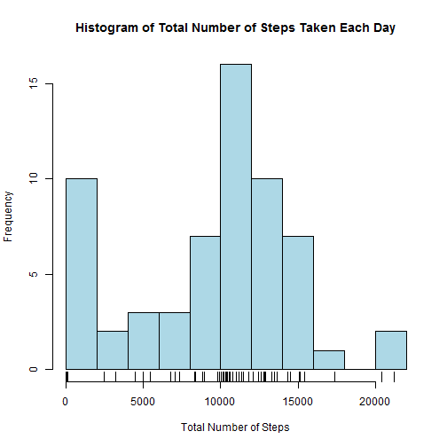
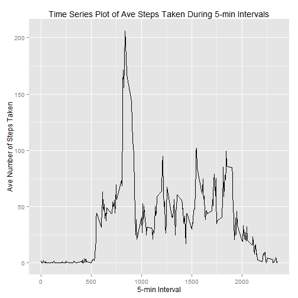
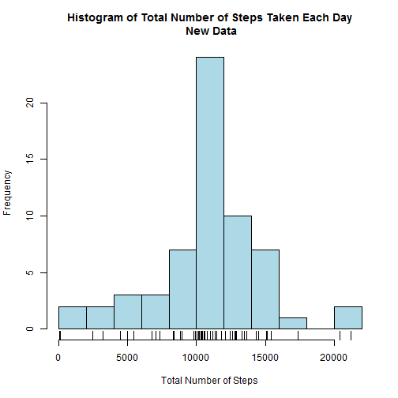
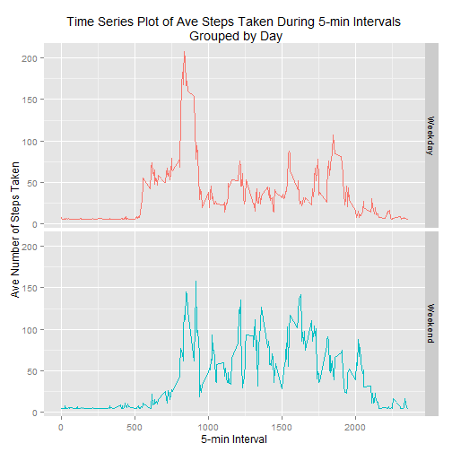

--- 
title: "Reproducible Research: Peer Assessment 1"
output: 
  html_document: 
    keep_md: true
--- 
# Reproducible Research: Peer Assessment 1

Coded by:Madrxn (https://github.com/madrxn/)

Reference: https://github.com/rdpeng/RepData_PeerAssessment1

## Introduction
It is now possible to collect a large amount of data about personal movement using activity monitoring devices such as a Fitbit (http://www.fitbit.com), Nike Fuelband http://www.nike.com/us/en_us/c/nikeplusfuelband), or Jawbone Up (https://jawbone.com/up). These type of devices are part of the "quantified self" movement - a group of enthusiasts who take measurements about themselves regularly to improve their health, to find patterns in their behavior, or because they are tech geeks. But these data remain underutilized both because the raw data are hard to obtain and there is a lack of statistical methods and software for processing and interpreting the data. This assignment makes use of data from a personal activity monitoring device. This device collects data at 5 minute intervals through out the day. The data consists of two months of data from an anonymous individual collected during the months of October and November, 2012 and include the number of steps taken in 5 minute intervals each day.

## Assignment
This assignment will be described in multiple parts. You will need to write a report that answers the
questions detailed below. Ultimately, you will need to complete the entire assignment in a single R
markdown document that can be processed by knitr and be transformed into an HTML file.
Throughout your report make sure you always include the code that you used to generate the output you present. When writing code chunks in the R markdown document, always use echo = TRUE so that someone else will be able to read the code. This assignment will be evaluated via peer assessment so it is essential that your peer evaluators be able to review the code for your analysis.
For the plotting aspects of this assignment, feel free to use any plotting system in R (i.e., base, lattice, ggplot2)
Fork/clone the GitHub repository created for this assignment (http://github.com/rdpeng/RepData_PeerAssessment1). You will submit this assignment by pushing your completed files into your forked repository on GitHub. The assignment submission will consist of the URL to your GitHub repository and the SHA1 commit ID for your repository state.
NOTE: The GitHub repository also contains the dataset for the assignment so you do not have to
download the data separately.

## Data
The data for this assignment can be downloaded from the course web site:
(https://d396qusza40orc.cloudfront.net/repdata%2Fdata%2Factivity.zip) [52K]

The variables included in this dataset are:

- steps: Number of steps taking in a 5minute interval (missing values are coded as NA )
- date: The date on which the measurement was taken in YYYYMMDD format
- interval: Identifier for the 5minute interval in which measurement was taken

The dataset is stored in a comma separated value (CSV) file and there are a total of 17,568 observations
in this dataset.

## Setting Global Options
The following code was used to set echo = TRUE and digits = 1.

```r
knitr::opts_chunk$set(echo = TRUE, options(digits = 1))
```

## Loading and preprocessing the data

```r
rawData <- read.csv("./activity.csv", header = TRUE,
                na.strings = "NA",
                colClass=c("integer", "Date", "integer"))
head(rawData)
```

```
##   steps       date interval
## 1    NA 2012-10-01        0
## 2    NA 2012-10-01        5
## 3    NA 2012-10-01       10
## 4    NA 2012-10-01       15
## 5    NA 2012-10-01       20
## 6    NA 2012-10-01       25
```


## What is mean total number of steps taken per day?

1) The aggregate function was used to calculate the total number of steps taken each day.

```r
library(dplyr)
sumSteps <- aggregate(rawData$steps, by = list(rawData$date), FUN = "sum", na.rm = TRUE)
sumSteps <- rename(sumSteps, Date=Group.1, Total=x)
head(sumSteps)
```

```
##         Date Total
## 1 2012-10-01     0
## 2 2012-10-02   126
## 3 2012-10-03 11352
## 4 2012-10-04 12116
## 5 2012-10-05 13294
## 6 2012-10-06 15420
```


2) To visualized the distribution of the total number of step taken each day, the data was plotted using a histogram.

```r
hist(sumSteps$Total, col = "lightblue",
        breaks = 8,
        main = "Histogram of Total Number of Steps Taken Each Day",
        xlab = "Total Number of Steps")
rug(sumSteps$Total)
```

 


```r
mean1 <- mean(sumSteps$Total)
mean1
```

```
## [1] 9354
```

```r
median1 <- median(sumSteps$Total)
median1
```

```
## [1] 10395
```
3) The mean and median for the total number of steps taken each day is 9354.2 and 10395, respectively. 


## What is the average daily activity pattern?

1) A time series plot, of the average number of steps taken (averaged across all days) vs. the 5-min intervals, was used to visualize the average daily activity pattern.    

```r
library(ggplot2)
qplot(interval, steps, data=na.omit(rawData),
      geom = "line",
      stat = "summary",
      fun.y = "mean",
      main = "Time Series Plot of Ave Steps Taken During 5-min Intervals",
      xlab = "5-min Interval",
      ylab = "Ave Number of Steps Taken")
```

 


```r
meanSteps <- with(rawData, aggregate(steps, by=list(interval), FUN = "mean", na.rm=TRUE))
meanSteps <- rename(meanSteps, Interval=Group.1, AveSteps=x)
MaxValue <- which.max(meanSteps$AveSteps)
MV <- meanSteps[MaxValue,]
MV
```

```
##     Interval AveSteps
## 104      835      206
```
2) The 5-min Interval that contains the maximum number of steps is 835, with 206.2 being the maximum number of steps.

## Imputing missing values

1) The total number of NA's is reported below.

```r
isNA <- is.na(rawData$steps)
sum(isNA)
```

```
## [1] 2304
```

2) I decided to take the average of the average step taken per day. This value gives a good estimate of how many steps overall per day were taken were taken from 10/01/2012 to 11/30/2012. 

```r
stepMean <- na.omit(rawData)
stepMean <- aggregate(steps~date, data=stepMean, mean)
overallMean <- mean(stepMean$steps)
overallMean
```

```
## [1] 37
```

3) The code below was used to replace NA values with the overall mean value. 

```r
newData <- rawData
newData$steps[isNA] <- overallMean
head(newData)
```

```
##   steps       date interval
## 1    37 2012-10-01        0
## 2    37 2012-10-01        5
## 3    37 2012-10-01       10
## 4    37 2012-10-01       15
## 5    37 2012-10-01       20
## 6    37 2012-10-01       25
```

4) The following code was used to calculate the total number of steps taken each day, with the new data set. The data was then ploted using a histogram and is prestented below. 

```r
newSum <- aggregate(newData$steps, by = list(newData$date), FUN = "sum")
newSum <- rename(newSum, Date=Group.1, Total=x)
head(newSum)
```

```
##         Date Total
## 1 2012-10-01 10766
## 2 2012-10-02   126
## 3 2012-10-03 11352
## 4 2012-10-04 12116
## 5 2012-10-05 13294
## 6 2012-10-06 15420
```


```r
hist(newSum$Total, col = "lightblue",
     breaks = 8,
     main = "Histogram of Total Number of Steps Taken Each Day\n New Data",
     xlab = "Total Number of Steps")
rug(newSum$Total)
```

 

```r
mean(newSum$Total)
```

```
## [1] 10766
```

```r
median(newSum$Total)
```

```
## [1] 10766
```


```r
meanChange <- mean(newSum$Total) - mean(sumSteps$Total)
medianChange <- median(newSum$Total) - median(sumSteps$Total)
meanChange
```

```
## [1] 1412
```

```r
medianChange
```

```
## [1] 371
```
5) Replacing NA's with the overall mean had an impact on the data. There was an increase of 1412 in the mean and and an increase of 371.2 in the median.


## Are there differences in activity patterns between weekdays and weekends?

1) The following code was used to create a new factor variable called "day" that has two levels (weekday and weekend)

```r
library(car)
newData$day <- as.factor(as.POSIXlt(newData$date)$wday)
newData$day <- recode(newData$day,"c(0,6)='Weekend'; c(1,2,3,4,5)='Weekday'")
head(newData)
```

```
##   steps       date interval     day
## 1    37 2012-10-01        0 Weekday
## 2    37 2012-10-01        5 Weekday
## 3    37 2012-10-01       10 Weekday
## 4    37 2012-10-01       15 Weekday
## 5    37 2012-10-01       20 Weekday
## 6    37 2012-10-01       25 Weekday
```

2) The average number of steps taken, averaged across all weekday days or weekend days vs. the 5-min interval was ploted and presented below.

```r
p <- qplot(interval, steps, data=newData,
      stat = "summary",
      fun.y = "mean",
      geom = "line",
      facets = day~.,
      col = day,
      main = "Time Series Plot of Ave Steps Taken During 5-min Intervals\n Grouped by Day",
      xlab = "5-min Interval",
      ylab = "Ave Number of Steps Taken")
p + theme(legend.position="none")
```

 
